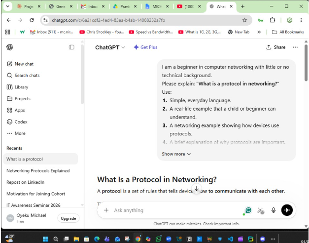
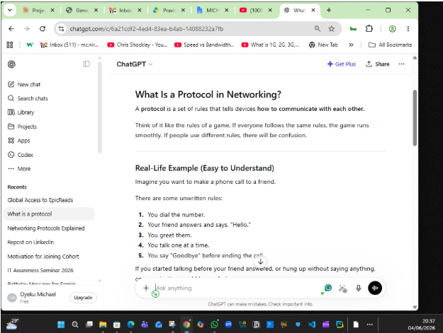

# Week 00 - Internet and Networking

Part of the DevOps Micro Internship (DMI) Cohort 3 with Agentic AI

---

# 🧑‍💻 Task 1: Using ChatGPT as Your Learning Assistant

## Scenario

You're new to DevOps and will frequently encounter technical questions. ChatGPT can be your learning companion.

## Your Task

Write a clear ChatGPT prompt to help you understand:

> "What is a protocol in networking? Explain with a simple real-life example."

   



## What I Learned 

Writing using a prompt is a good approach to learn prompt engineering, which is the skill of communicating effectuively with an AI agent to het high-quality responses. With this, Ai was able to give detail information with familiar oobject to explain indepth about network protocol.


# 🌐 Task 2: Internet and Networking

## Scenario

Your friend is launching an online bookstore named **EpicReads**.

He asked you to explain how users globally can access his website hosted in Finland.

## Your Task

Write a short explanation (**100–150 words**) that includes:

* Packet Switching
* IP Address
* TCP/IP
* HTTP/HTTPS

💡 **Tip:** You may use ChatGPT (as demonstrated in Task 1) to refine your explanation.

After a successful launch of the website, when a user anywhere in the world visits EpicReads, their request is sent across the Internet using packet switching, where the data is divided into small packets that travel through different routes before being reassembled at the destination. The website hosted in Finland is like a house on the street, which can be located with a unique number. The website is an entity on the network which is identified by a unique IP address, which enables devices to locate and communicate with the server. The TCP/IP protocol suite ensures that the packets are delivered accurately, in the correct order, and without data loss. Once the connection is established, HTTP (Hypertext Transfer Protocol) is the path used to request and deliver web pages. In practice, HTTPS is preferred because it encrypts the communication between the user's browser and the server, protecting sensitive information such as login credentials and payment details from unauthorised access.

# 🏗️ Task 3: Application Architecture & Stack

## Scenario

EpicReads bookstore has two application versions:

### Two-Tier Application

* Frontend
* Database

### Three-Tier Application

* Frontend
* Backend
* Database


## Diagram Screenshot / Photo


## Technologies Used

### Frontend

* Next.js
* Taliwind CSS

### Backend

* Node.js
* Jwt (Json web Token)

### Database

* MongoDb
* Mysql


# 🌍 Task 4: Domain Name & DNS (Basic Concepts)

## Scenario

Your friend's bookstore **EpicReads** is currently accessible through:

```text
52.172.142.222:3000
```

He purchased the domain:

```text
epicreads.com
```

## Your Task

In **50–100 words**, explain in your own words:

1. What is DNS (Domain Name System)?
2. Which DNS record type should be used to connect the domain to the given IP, and why?

## Answer

DNS (Domain Name System) could be referred to as the internet’s phonebook. It helps to translate  easy-to-remember domain names such as epicreads.com, google.com into IP addresses that computers use to locate websites.

For example, to connect epicreads.com to 52.172.142.222, an A (Address) Record should be used. An A Record maps a domain name directly to an IPv4 address, allowing users who type epicreads.com in their browser to reach the bookstore server hosted at 52.172.142.222. The port 3000 would still need to be handled by the web server or a reverse proxy configuration.


# 💻 Task 5: Visual Studio Code Setup (Hands-on)

## Your Task

Install Visual Studio Code (if not already installed).

Take a screenshot of your VS Code environment showing:

* Terminal open inside VS Code
* Running a basic command:

### Windows

```powershell
dir
```

### Linux / macOS

```bash
pwd
ls
```

* Your selected VS Code theme clearly visible


# 🔗 Task 6: Publish Your Assignment as a LinkedIn Post

## Objective

Publishing on LinkedIn helps you:

* Build your professional online presence
* Reinforce your learning
* Document your DevOps journey publicly

## Your Task

Summarize your answers from Tasks 1–5 into a LinkedIn post.

Clearly structure your post into the following sections:

* ChatGPT
* Internet & Networking
* App Architecture
* DNS
* VS Code Setup

Add the following credit note at the end of your post:

> **P.S. This post is part of the DevOps Micro Internship (DMI) with Agentic AI — Cohort 3 — by Pravin Mishra. My graded progress is public: https://dmi.pravinmishra.com/s/YOUR-GITHUB-USERNAME.html · Start your DevOps journey: https://dmi.pravinmishra.com/?utm_source=student&utm_medium=ps-linkedin&utm_campaign=cohort3**


## LinkedIn Post URL

https://www.linkedin.com/posts/oyeku-michael-2215a920_devops-micro-internship-the-important-of-share-7485089326230482945-CfzC/?utm_source=share&utm_medium=member_desktop&rcm=ACoAAARb4_kBmnrqkDDsuuYPPXrVCKNYnevZPAo

## LinkedIn Post Backup Copy

DevOps Micro-Internship – the Important of Building the Foundation
Every successful DevOps journey begins with a strong understanding of the fundamentals. Before exploring cloud platforms, automation, CI/CD, containers, and Infrastructure as Code (IaC), it is essential to grasp the core technologies that power modern software systems. During our introductory class, we were introduced to these foundational concepts and their significance, providing a clear understanding of how each one contributes to the DevOps ecosystem and prepares us for the learning journey ahead.

ChatGPT
Effective use of ChatGPT starts with good prompt engineering. Asking clear, structured questions helps generate more accurate, relevant, and insightful responses, making AI a valuable tool for learning, research, documentation, and problem-solving throughout the DevOps journey.

Internet & Networking
A strong understanding of Internet and networking is essential. Concepts such as packet switching, IP addresses, the TCP/IP protocol suite, and HTTP/HTTPS explain how devices communicate, how data travels across networks, and how users securely access web applications from anywhere in the world.

App Architecture
Modern applications are built using multiple technologies that work together. Frameworks such as Next.js, backend technologies like Node.js and Express.js, and databases such as MongoDB each play a unique role in delivering scalable, reliable, and high-performing web applications.

DNS
The Domain Name System (DNS) is one of the Internet's core services. It translates easy-to-remember domain names into IP addresses, allowing users to access websites without needing to remember numerical network addresses.

VS Code Setup
A productive development environment starts with the right tools. Visual Studio Code, together with essential extensions and Git integration, provides a powerful workspace for writing code, managing projects, collaborating with teams, and supporting DevOps workflows.

These foundational concepts form the starting point for every aspiring DevOps engineer. Understanding them creates a strong base for exploring Linux, Git, cloud computing, Docker, Kubernetes, CI/CD, Infrastructure as Code, monitoring, security, and other core DevOps practices in the weeks ahead.

I'm looking forward to learning, building, collaborating, and sharing my progress throughout this program.

 **P.S. This post is a part of DevOps Micro Internship with Agentic AI Cohort-3 by Pravin Mishra. You can start your DevOps journey by joining this Discord community: https://discord.pravinmishra.com/**

# Reflection – Week 0

### What did you find easy?

I found the mode of communication to be very effective and easy to follow. The approach used to deliver the information was engaging, ensuring that everyone could follow along regardless of their level of understanding. The concepts were explained using simple, relatable examples, which made them easier to grasp and apply. Overall, the teaching style created an inclusive and interactive learning environment that encouraged active participation.

### What was difficult?

One aspect I found a bit challenging was the long duration of the sessions. Sitting in front of my computer for nearly eight hours at a stretch required a great deal of focus and endurance. While the sessions were engaging and informative, incorporating short breaks between segments could help participants stay refreshed and maintain their concentration throughout the day.
---

### What will you improve next week?

One thing I would like to improve this week is my attention to detail. I want to be more deliberate in following instructions, observing key information, and reviewing my work carefully to minimize mistakes and ensure I fully understand each task.

---

## 📌 About DMI & CloudAdvisory

DevOps Micro Internship (DMI) is a project-based DevOps program run by Pravin Mishra (The CloudAdvisory) focused on real-world execution, systems thinking, and career readiness.

It helps learners build strong DevOps foundations with hands-on experience.


## 📌 Resources

- 🌐 **DMI Official Website:** https://dmi.pravinmishra.com?utm_source=github&utm_medium=readme  
- 🎓 **University:** https://university.pravinmishra.com?utm_source=github&utm_medium=readme  
- 💬 **Discord Community:** https://discord.pravinmishra.com?utm_source=github&utm_medium=readme  
- 📝 **Blog:** https://dmi.pravinmishra.com/blog?utm_source=github&utm_medium=readme  
- ▶️ **YouTube Playlist (DMI Cohort 3):** https://www.youtube.com/playlist?list=PLFeSNDtI4Cho  
- 🔗 **Pravin Mishra (LinkedIn):** https://www.linkedin.com/in/pravin-mishra-aws-trainer/  
- 🏢 **CloudAdvisory (LinkedIn):** https://www.linkedin.com/company/thecloudadvisory/

---

*This submission is part of DevOps Micro Internship (DMI) Cohort 3 — Agentic AI Track*