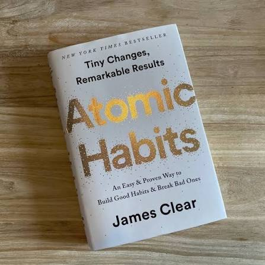
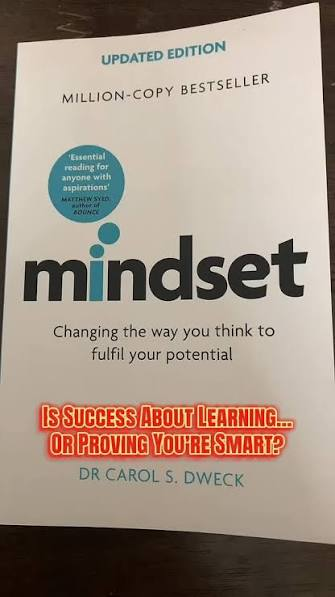
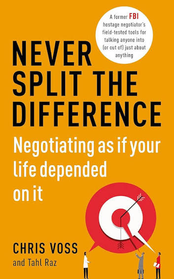
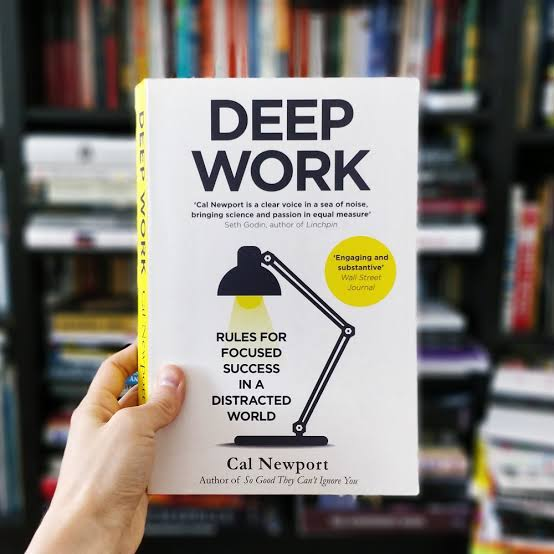
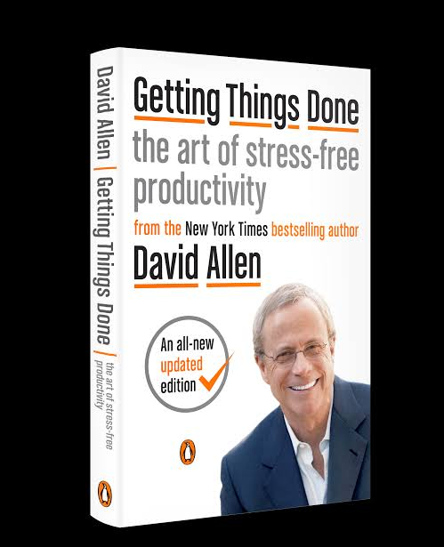
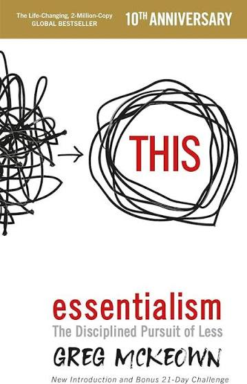
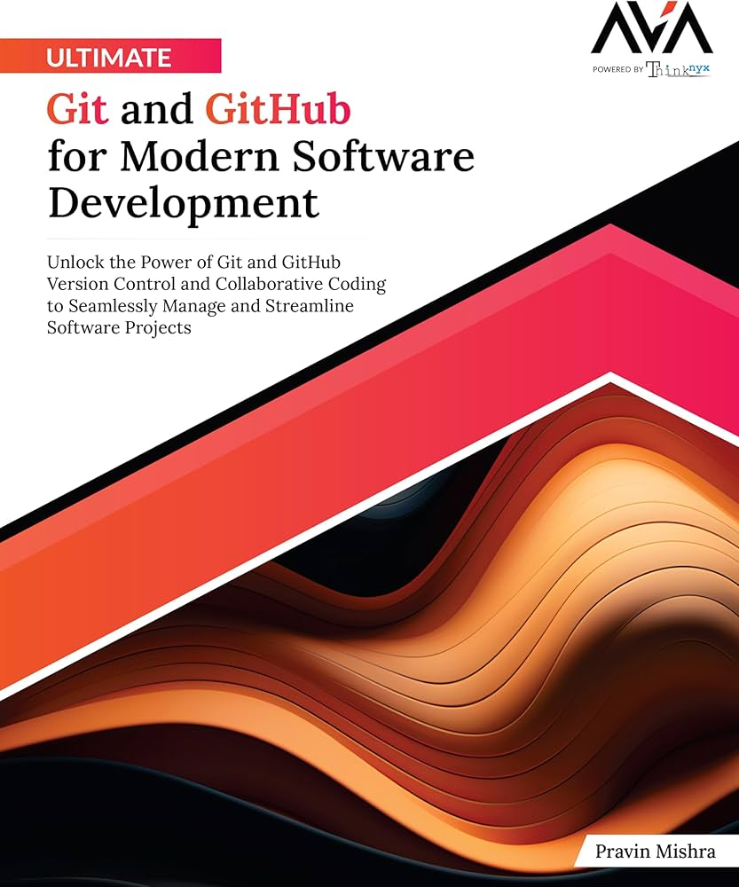
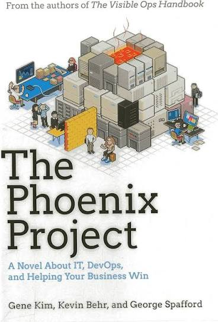

# Week 01 — Success Mindset (Mindset OS)

Part of the DevOps Micro Internship (DMI) Cohort 3 with Agentic AI

---

## Purpose (Read This First)

This week is not motivation homework.

This is you building your **Mindset OS** — the system you will use for the next 5 months (and honestly, for years).

### Expectations

* Be honest.
* Be specific.
* Be practical.
* Write like an adult professional: clear sentences, no one-liners.

You will reuse this in later weeks. So do it properly once.

---

# Assignment 1. What is something you believe to be true that most people around you would disagree with?

### Rules

* No "safe" answers.
* Must be your real belief (not copied from internet).
* Minimum 50 words.

**Hint:** What do you believe about career, money, learning, discipline, relationships, health, success, life, tech industry, etc. that most people don't agree with?

## Answer

 I believe that the popular idea of "work-life balance" is actually holding people back. Most people treat work and life like two separate boxes that must be kept apart. They think they need to "turn off" their professional brain as soon as the clock hits 5:00 PM to stay happy.

I disagree. I believe in "work-life integration." If you are serious about becoming an expert in your field, you shouldn't try to separate your passions from your daily life. When your curiosity and your drive to learn are part of your everyday habits—not just "work tasks"—you stop feeling like you need a break from your career.

When you fully embrace this, you don't feel like you are constantly switching roles or trying to "escape" your job. Instead, your personal growth makes you better at your work, and your work challenges make you a smarter person in your personal life. Trying to perfectly balance the two often leads to average results. For those who want to reach the top, the better path is to live a life where your growth and your career work together as one.
---

# Assignment 2. What are the top 3 objective truths you discovered through experimentation and results?

### Definition

Objective truths do not depend on opinions. They hold true regardless of how people feel.

Write each truth in this format:

**Truth:** (1 sentence)

**Evidence from my life:** (2–4 lines: what you tried + what happened)

---

## Truth #1

### Truth

Doing a little bit every day is much better than trying to do a lot all at once.

### Evidence from my life

I used to try to learn everything in one long, exhausting weekend, but I would always get burned out and forget what I learned. When I switched to just one hour of focused work every day, I started remembering more and actually finishing the projects I started.

---

## Truth #2

### Truth

You only learn what is real by doing the work, not by just thinking about it.

### Evidence from my life

I once wasted weeks reading comments and worrying about which path was "the best." I finally stopped worrying and just started building a simple project. I learned more in three days of doing the work than I did in weeks of just reading other people's opinions.

---

## Truth #3

### Truth

You can solve harder problems if you change your surroundings.

### Evidence from my life

I used to have a hard time concentrating because my workspace was too noisy and full of distractions. When I moved to a quiet, dedicated spot and put my phone in another room, I suddenly found that I could solve complex problems twice as fast as before.
---

# Assignment 3. What does your 2.0 version look like?

### Instructions

Write as if a journalist is writing about you **3 to 7 years from now** (not 20 years).

**Minimum 300 words.**

### Rules

* Write in past tense, like it already happened.
* Don't use "likes to / wants to / hopes to."
* Use specifics:

  * built
  * shipped
  * led
  * published
  * earned
  * relocated
  * contributed
* Include skills proof:

  * projects
  * portfolios
  * GitHub
  * blogs
  * certifications
  * job role
  * leadership
  * community contribution
* Add 1–3 images if you can (optional but powerful).

### Publish It Publicly On Any ONE

* LinkedIn
* Medium
* WordPress
* Blogspot
* Personal blog
* Portfolio page

Include this line:

> **P.S. This post is part of the DevOps Micro Internship (DMI) with Agentic AI — Cohort 3 — by [Pravin Mishra](https://www.linkedin.com/in/pravin-mishra-aws-trainer/). My graded progress is public: https://dmi.pravinmishra.com/s/YOUR-GITHUB-USERNAME.html · Start your DevOps journey: https://dmi.pravinmishra.com/?utm_source=student&utm_medium=ps-blog&utm_campaign=cohort3**

## Your Article

# Michael's Next Chapter: From Tech Pro to Global Mentor

**By The Career Insider | July 2031**

Five years ago, Michael stood at one of the most defining moments of his professional journey. He had explored multiple areas of technology—from software and networking to cybersecurity and cloud computing—but his experience lacked a single area of deep specialization. While many viewed this as a weakness, Michael recognized it as a unique strength. His broad knowledge gave him an uncommon ability to see how technologies, people, and business objectives fit together.

Rather than continuing to chase every new trend, Michael made a deliberate decision: he would focus on building expertise instead of merely collecting knowledge.

He committed himself to mastering DevOps and Cybersecurity—two disciplines that form the backbone of today's digital infrastructure. The journey was demanding. It required discipline, consistency, and an unwavering commitment to lifelong learning. Yet Michael understood that meaningful success is built through daily progress, not overnight breakthroughs.

Each day became an investment in his future. He studied emerging technologies, practiced relentlessly, earned industry-recognized certifications, and developed practical solutions to real-world challenges. Instead of creating projects solely for learning, he built applications, automation pipelines, cloud architectures, and security solutions that organizations could genuinely use.

His GitHub portfolio gradually evolved into more than a collection of repositories. It became a showcase of innovation, technical excellence, and problem-solving ability. Recruiters, hiring managers, and fellow engineers began to recognize him as a dependable technology professional who consistently delivered practical, high-quality solutions.

But Michael's greatest achievement extended far beyond technical expertise.

He discovered that his true calling was helping others succeed.

As his career advanced, he noticed that many aspiring technology professionals struggled with the same uncertainty he had once experienced. They possessed talent and ambition but lacked guidance, structure, and confidence. Rather than simply sharing technical knowledge, Michael dedicated himself to becoming the mentor he had once needed.

He launched a mentorship program focused on empowering future professionals in DevOps, Cybersecurity, Cloud Computing, and modern IT practices. Through structured coaching, career roadmaps, hands-on projects, and practical demonstrations, he simplified complex technical concepts into lessons that beginners could confidently understand and apply.

Over the years, he mentored hundreds of students, career changers, and young professionals from different parts of the world. Many secured their first technology jobs, earned professional certifications, or advanced into leadership positions because of the knowledge, encouragement, and accountability he provided.

By 2031, Michael had become a respected technology leader at a global organization. He oversaw large-scale cloud platforms, designed secure infrastructure, led DevOps transformation initiatives, and implemented cybersecurity strategies that protected critical business systems across multiple regions.

His leadership style distinguished him from many of his peers. He believed that great technology is built by empowered people. Every system he designed emphasized reliability, security, automation, scalability, and collaboration. Every team he led reflected the same principles.

Professional success also brought personal freedom.

Michael intentionally designed a life where his corporate career complemented his passion for mentorship. His expertise in technology funded initiatives that educated, inspired, and equipped the next generation of IT professionals. Conferences, workshops, online training programs, and mentoring communities became natural extensions of his daily work.

Looking back, Michael understood that none of his accomplishments happened by chance.

His transformation was the result of thousands of consistent decisions made over several years. He treated his habits as carefully as engineers maintain critical production systems. Every day, he showed up with purpose. Every promise he made to himself became another building block for the future he envisioned. He embraced continuous learning, welcomed constructive feedback, and viewed every challenge as an opportunity to improve.

Most importantly, he stopped measuring success by titles alone.

Instead, he measured it by the number of problems he solved, the people he empowered, and the lasting impact he created.

Michael did not simply climb the career ladder.

He built an entirely new path—one where technical excellence, servant leadership, and lifelong learning came together to create a legacy that continues to influence both technology and the people behind it.

### Public Link

https://www.linkedin.com/pulse/michaels-next-chapter-from-tech-pro-global-mentor-career-michael-p51qe

<<<<<<< HEAD
https://medium.com/@michael.oyeku/michael-oyekus-next-chapter-from-tech-pro-to-global-mentor-faee87c6c906te 
`__________________________`
=======
`Add your URL here`
>>>>>>> upstream/main

---

# Assignment 4. Have you ever cut corners (unethical / dishonest / shortcut behavior — not necessarily illegal)? If yes, how did it make you feel?

### Important

You don't need to write the full story.

Focus on the feeling:

* guilt
* fear
* shame
* stress
* regret
* numbness
* etc.

This is about self-awareness, not judgment.

### Answer Format

**Yes / No**

If Yes:

**What emotion did you feel?** (minimum 50–100 words)

## Answer

When I chose to cut corners, I didn’t feel a sudden rush of guilt. Instead, I felt a quiet, heavy sense of shame and stress.

I realized I was faking my progress, and that felt hollow. Even when I got the result I wanted, it brought no real satisfaction. Worse, I lived in constant fear that I would be exposed as a fraud later on.

I learned that integrity is the most valuable part of my career. Small, "harmless" shortcuts didn’t just save time—they stole the pride I should have felt in my hard-earned growth. Choosing the easy path felt like a betrayal of the person I am working to become.

---

# Assignment 5. What are 10 non-fiction books you plan to read in the next 1 year?

### Rules

* Mention **Title + Author**
* Any language allowed
* No fiction novels

### Tip

Choose books that improve:

* mindset
* communication
* productivity
* health
* money
* career
* leadership

## Book List

1. Atomic Habits by James Clear

2. Mindset (Think Like a High Performer)— Carol S. Dweck

3. The Psychology of Money — Morgan Housel

4. How to Win Friends and Influence People — Dale Carnegie

5. Never Split the Difference — Chris Voss

6. Deep Work — Cal Newport

7. Getting Things Done — David Allen

8. Essentialism — Greg McKeown

9. Ultimate Git and GitHub for Modern Software Development: Unlock the Power of Git and GitHub Version Control and Collaborative Coding to Seamlessly Manage ... Software Projects (English Edition) - Pravin Mishra 

10. The Phoenix Project

---

# Assignment 6. What are the things you will measure regularly in your life and career?

### Rules

List topics only. No need to share numbers.

### Must Include

* Learning / skill
* Output / proof
* Health / energy
* Time / focus
* Money / finance (personal or business)

### Example

* Learning hours per week
* Deep work sessions per week
* Projects shipped / documented
* Steps / workouts
* Sleep hours
* Spending tracker

## My Metrics

* Learning hours
* Deep work sessions
* Hands-on labs completed
* Projects completed
* GitHub commits
* Technical content published
* AExercise sessions
* modules completed
* Sleep quality
* Weekly goals completed
---

# Assignment 7. Brain Dump + 5-Month System Plan

## Step 1: Brain Dump (Private)

Do a brain dump of everything in your mind into a notebook.

Examples:

* Bills
* Tasks
* Worries
* Goals
* Pending messages
* Ideas
* Responsibilities

### Did You Do It?

**Yes / No**

Answer:

Complete today's DevOps lesson.
Become a world-class DevOps Engineer.
Complete the DevOps Micro Internship (DMI).
Build a GitHub portfolio.
Improve LinkedIn profile.
Stop procrastinating.
Professional development.
Can I stay consistent for years?
Build daily discipline.
---

## Step 2: Your 5-Month Routine + Focus Blocks

Create a simple plan you can realistically follow for the next 5 months.

### Weekly Routine

Example:

* Mon–Thu: 60 min deep work
* Sat: DMI session
* Sun: Weekly review

#### My Weekly Routine

Mon - Thur: 150-minute deep work session.
Sat: DMI session
Sun: Weekly review
---

### Focus Blocks

#### When Will You Do DMI Work? (Days + Time)

**Activity**	            ** Days**	                **Time**
DMI Learning	             Monday– Thursday	   6:00 AM – 7:30 AM
Hands-on Labs	             Monday– Thursday	   8:30 PM – 10:30 PM
Weekly Review	             Friday	             6:00 AM – 7:30 AM
Live DMI Session	         Saturday	           Scheduled session
Assignment & Project	     Saturday	           3:00 PM – 6:00 PM
Reflection & Documentation Saturday	           7:00 PM – 8:30 PM
Weekly Review & Planning	 Sunday	             6:00 AM – 7:00 AM & 9:00 PM – 9:45 PM

#### How Many Sessions Per Week?

13 Sessions
---

### Distraction Rules

Examples:

* Phone rules
* Social media rules
* Environment setup

#### My Distraction Rules

One Task at a Time
Phone-Free during Deep Work
No Social Media Before Completion of my task
One Learning Path per time
Protect My Calendar schedules
Control My Environment
No Entertainment During Focus Blocks time
Finish Every Session with Output
Handle Interruptions intentionally
---

# Reflection – Week 1

### Biggest insight I got about myself this week

I never imagined I could sit in a class for seven hours. I did it at DMI. That experience proved to me that my biggest limitation has never been my ability—it has been my mindset and the systems I use. If I can remain focused for seven hours on learning, then I have the capacity to become a successful DevOps engineer.

This week also made me realize that my career has not been held back by a lack of intelligence or opportunities, but by a lack of consistent execution. I have spent years learning different areas of technology, yet I often moved from one topic to another without mastering one path or building enough real projects.

The lesson on long-term thinking changed my perspective. I now understand that success in DevOps is built through small, consistent actions that compound over time. Every lab, every GitHub commit, every project, and every hour of focused practice brings me one step closer to my goal.

The biggest takeaway for me is that I don't need more motivation—I need better systems. My future will be determined by my daily habits, not my occasional bursts of enthusiasm.

### My biggest weakness/loop I noticed

The biggest pattern I noticed is that I consume more than I create. I enjoy learning through videos, courses, and reading, but I do not always convert that knowledge into practical projects or documented work.

Another weakness is that I depend too much on motivation. When I feel inspired, I make good progress, but when motivation fades, my consistency suffers. This has caused me to start many learning journeys without completing them or showcasing my skills.

I also realized that I tend to spread my attention across too many interests, which has slowed my growth in a single professional direction. Instead of developing deep expertise in DevOps, I often switched between different technology fields.

Going forward, I want to replace this cycle of learning without execution with a habit of learning, building, documenting, and reviewing every week.
### One system I will implement from this week (exact habit + time)

System: Daily DevOps Deep Work Routine

Monday – Thursday

6:00 AM – 7:30 AM: DMI learning, official documentation, and note-taking.
8:00 PM – 9:30 PM: Hands-on labs, assignments, project work, and GitHub commits.

Weekly Review	             Friday	             6:00 AM – 7:30 AM

Saturday

Attend the DMI session.
Complete the weekly assignment.
Build or improve one DevOps project.

Sunday (7:00 AM – 8:00 AM)

Conduct a weekly review.
Perform a brain dump.
Measure my progress.
Plan the next week's priorities.

### LinkedIn Post

Paste your LinkedIn post link here:

<<<<<<< HEAD
`__________________________`
Week 1 of My DevOps Micro-Internship (DMI): A Mindset Shift
=======
`Add your URL here`
>>>>>>> upstream/main

I never imagined I could sit in a class for seven hours. I did it at DMI.

That alone taught me something important: many of the limits we place on ourselves are self-imposed.

Going into the first session, I expected to learn about DevOps tools and technologies. Instead, the first lesson focused on something even more fundamental—mindset.

Some of my biggest takeaways from Week 1 were:

✅ Think long-term. Great careers are built through small, consistent actions that compound over time.

✅ Upgrade your identity. Don't wait to become the professional you want to be—start thinking and acting like that person today.

✅ Systems beat motivation. Motivation comes and goes, but well-designed systems keep you moving even on difficult days.

✅ Treat failure like an engineer. Analyze it, learn from it, improve your process, and move forward. Every setback contains data.

The session also challenged me to reflect on my own career journey.

I realized that my biggest challenge has never been a lack of interest or willingness to learn. It has been turning learning into consistent execution.

As someone transitioning into DevOps, I've made a commitment to stop simply consuming content and start building consistently. Over the next few months, I'll be focusing on:

Building hands-on DevOps projects
Documenting my learning journey
Sharing insights publicly
Developing habits that support long-term growth

This is just Week 1, but I already feel like I'm building more than technical skills—I'm building the mindset and discipline needed for a sustainable career.

A big thank you to Pravin Mishra and the lead mentor Anjana Muthunayake and the co-mentors Ranbir Kaur Bhupendra Bhati Greg Odi for your support and starting this journey with foundation that matters most

I'm looking forward to the journey ahead.

#DevOps #LearningInPublic #CareerGrowth #CloudComputing #Linux #Automation #ContinuousLearning #ProfessionalDevelopment #Mindset #DMI
---

## 10. Proof of Work

- LinkedIn Post URL: **(https://www.linkedin.com/posts/oyeku-michael-2215a920_devops-learninginpublic-careergrowth-share-7478627044805812224-yM-f/?utm_source=share&utm_medium=member_desktop&rcm=ACoAAARb4_kBmnrqkDDsuuYPPXrVCKNYnevZPAo)**  
- Blog / Medium : **(https://medium.com/@michael.oyeku/week-1-of-my-devops-micro-internship-dmi-a-mindset-shift-9ffd43b8a8a0)**  

---

## 📌 About DMI & CloudAdvisory

DevOps Micro Internship (DMI) is a project-based DevOps program run by Pravin Mishra (The CloudAdvisory) focused on real-world execution, systems thinking, and career readiness.

It helps learners build strong DevOps foundations with hands-on experience.

## 📌 Resources

- 🌐 **DMI Official Website:** https://pravinmishra.com/dmi  
- 🎓 **DevOps for Beginners (Udemy):** https://www.udemy.com/course/devops-for-beginners-docker-k8s-cloud-cicd-4-projects/  
- 🎓 **Ultimate Agentic AI DevOps with Clude Code** https://www.udemy.com/course/ultimate-agentic-ai-devops-with-claude-code/?referralCode=448389767BC96284087B
- 🎓 **DevOps with Claude Code: Terraform, EKS, ArgoCD & Helm** https://www.udemy.com/course/devops-with-claude-code-terraform-eks-argocd-helm/?referralCode=1C5B734505D65A010FA3
- ▶️ **YouTube Playlist (DMI Cohort 3):** https://www.youtube.com/playlist?list=PLFeSNDtI4Cho  
- 🔗 **Pravin Mishra (LinkedIn):** https://www.linkedin.com/in/pravin-mishra-aws-trainer/  
- 🏢 **CloudAdvisory (LinkedIn):** https://www.linkedin.com/company/thecloudadvisory/

---

*This submission is part of DevOps Micro Internship (DMI) Cohort 3 — Agentic AI Track*