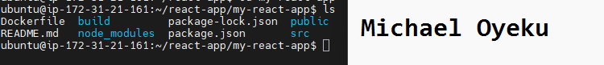
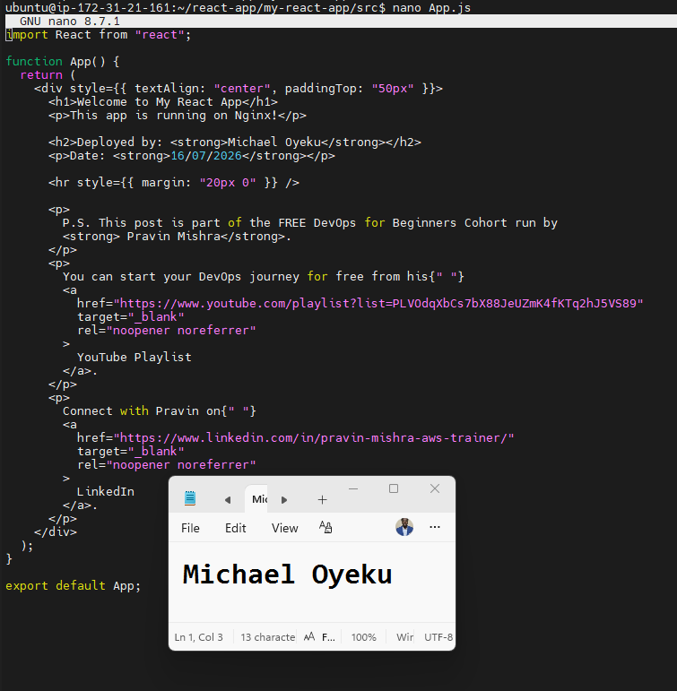
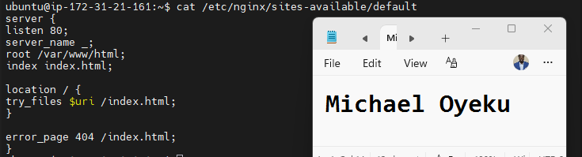

Assignment 2 — Deploy a React App on Ubuntu VM Using Nginx

Task 1 — Setup Environment (Node.js & npm)
Screenshot 1 — Output of node -v && npm -v showing installed versions

Task 2 — Setup Environment (Nginx)

Screenshot 2 — Output of systemctl status nginx --no-pager showing Active (running)

Task 3 — Clone React Application
Screenshot 3 — Output of ls inside the my-react-app directory showing project files

Task 4 — Modify Application (Personalization)
Screenshot 4 — nano App.js open showing your full name and date filled in

Task 5 — Build React Application
Screenshot 5 — Output of ls inside my-react-app showing the build/ folder generated

Task 6 — Deploy React Build to Nginx Web Root

Screenshot 6 — Output of ls /var/www/html/ showing the deployed build contents

Task 7 — Configure Nginx for React Application
Screenshot 7 — Output of systemctl is-active nginx showing active

Screenshot 8 — Output of cat /etc/nginx/sites-available/default showing the Nginx config

Task 8 — Test Deployment
Screenshot 9 — Output of curl ifconfig.me showing the server's public IP address

Screenshot 10 — Browser showing the deployed React app at http://<public-ip> with your name and date visible

