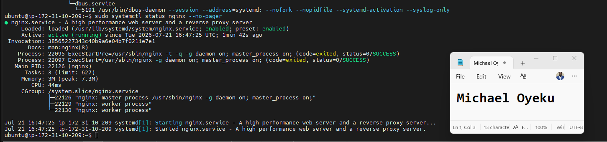
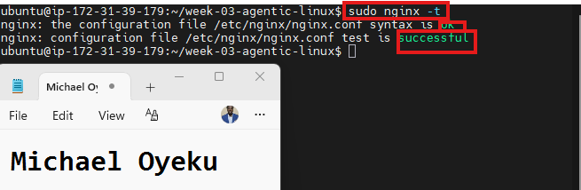
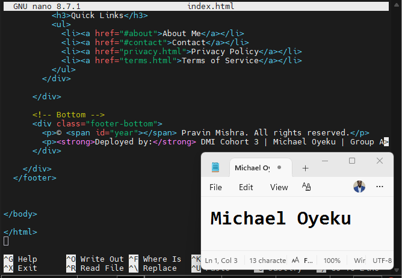
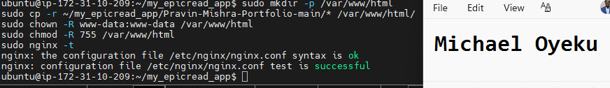
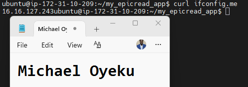
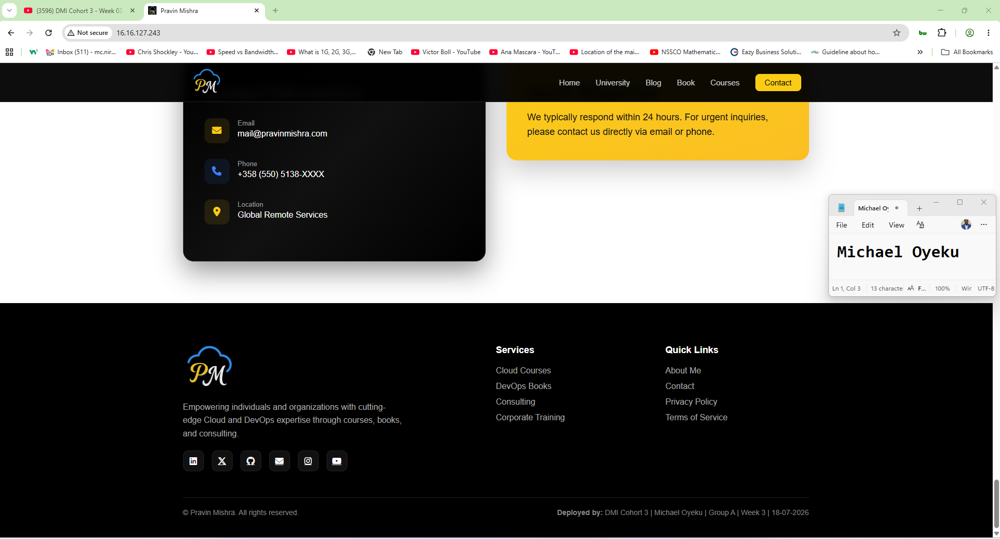
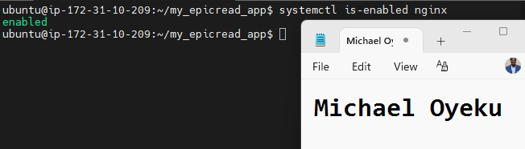
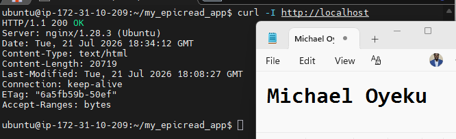
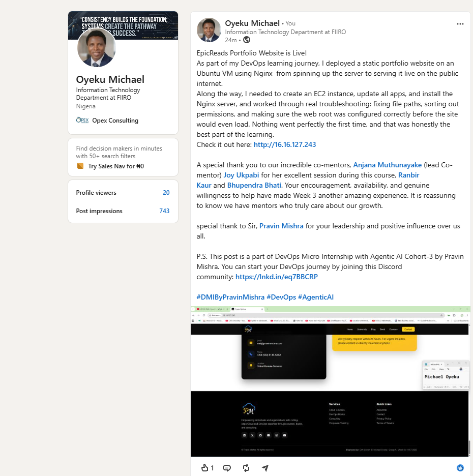

Assignment 4 — Deploy EpicReads Portfolio Website via Nginx

Part of the DevOps Micro Internship (DMI) Cohort 3 with Agentic AI

Purpose
In this assignment, you will deploy a static portfolio website on an Ubuntu VM using Nginx. You will download the website template, add your ownership proof in the footer, deploy the files to the Nginx web root, and verify the website is publicly accessible via a browser.

Task 0 — Pre-flight Check
Goal
Verify the Ubuntu VM and Nginx are ready for deployment.
Evidence
Screenshot 0 — Output of sudo systemctl status nginx --no-pager showing Active (running)

Task 1 — Get the Website Source Code

Screenshot 1 — Output of ls -la showing the extracted project folder

Task 2 — Add Ownership Proof (Anti-Copy Change)

Screenshot 2 — Nano editor open with the updated footer showing your Full Name, Group, Week, and Date

Task 3 — Deploy Website via Nginx

Screenshot 3 — Output of sudo nginx -t showing configuration test successful

Screenshot 4 — Output of ls /var/www/html showing deployed website files

Task 4 — Verify Website is Live

Screenshot 5 — Output of curl ifconfig.me showing the server's public IP address

Screenshot 6 — Browser showing the live website with your Full Name and deployment details in the footer

Task 5 — Mini Real DevOps Operational Check

Screenshot 7 — Output of systemctl is-enabled nginx

Screenshot 8 — Output of curl -I http://localhost showing 200 OK

LinkedIn Post (Mandatory)
Evidence
LinkedIn Post URL
https://www.linkedin.com/posts/oyeku-michael-2215a920_dmibypravinmishra-devops-agenticai-share-7485407321632972800-qVEf/?utm_source=share&utm_medium=member_desktop&rcm=ACoAAARb4_kBmnrqkDDsuuYPPXrVCKNYnevZPAo

Screenshot — Published LinkedIn post showing the live website with your Full Name in the footer

