Week 03

Assignment 6 — Build an AI-Assisted Linux Health Check (AI-Assisted Linux Incident Triage)

Task 1 — Confirm the Healthy Baseline and Create the Workspace

Screenshot 1 — Output of `systemctl is-active nginx`, `ss -ltn | grep ':80'`, and `curl -I http://localhost`

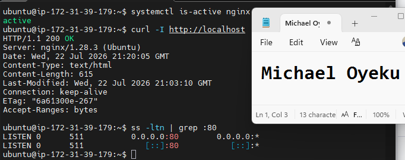

Screenshot 2 — Output of `pwd` and `find . -maxdepth 4 -type d | sort` showing the workspace folder structure

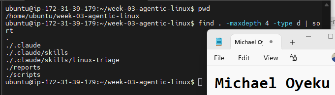

**1. What proves that Nginx is running?**

The output of systemctl is-active nginx returning the word active — this comes directly from systemd, the service manager, confirming the Nginx process is currently running (not just installed).

**2. What proves that the server is listening for HTTP traffic?**
The ss -ltn | grep ':80' output showing a line with port 80 in a LISTEN state — this confirms something (Nginx) has actually bound to that port and is ready to accept incoming connections, not just that the process exists.

**3. Why must you capture a healthy baseline before simulating an incident?**
Without knowing what "normal" looks like, you can't tell what actually changed during the incident. A baseline gives you something concrete to compare against later — for example, confirming the recovery step in Task 5+ actually restored things to the same state, not just "some" working state.

Task 2 — Create Project Context and Safety Rules in CLAUDE.md

Screenshot 3 — CLAUDE.md open in VS Code showing all four sections (Project Overview, Incident Workflow, Safety Rules, Output Rules)

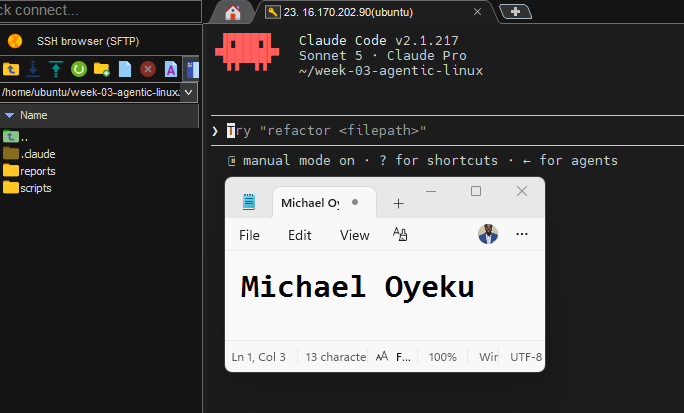

**1. Why should Claude receive project-specific operational rules?**

Without explicit rules, an AI assistant might take actions that seem reasonable in general but are dangerous in this specific context — like restarting a service on impulse. Project-specific rules (like this CLAUDE.md) constrain Claude's behavior to exactly what's safe and appropriate for this particular system, rather than relying on generic judgment.

**2. Why is the human required to execute the recovery command?**

The human has context Claude doesn't — knowledge of the production environment, timing, business impact, and other systems that might be affected. Requiring human execution keeps a person accountable for the actual change, and adds a check against an AI making an incorrect diagnosis and acting on it autonomously.

**3. Which rule prevents Claude from making an unsupported diagnosis?**

The Safety Rules line: "Do not claim a root cause unless the report contains supporting evidence." This forces Claude's analysis to be grounded in the actual Bash report output, rather than guessing or hallucinating a cause that sounds plausible but isn't backed by evidence.

#Task 3 — Use Agentic AI to Plan Before Writing the Script

Screenshot 4 — Claude Code showing the five-check plan and read-only inspection results

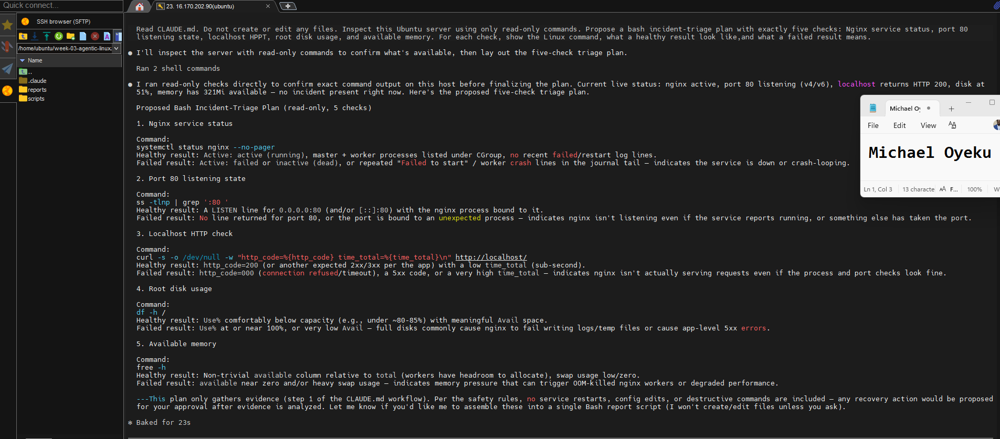

**1. Which part of this task represents the Gather phase?**
The read-only inspection of the Ubuntu server represents the Gather phase. Claude uses commands to collect information about Nginx, port 80, the HTTP response, disk usage, and available memory.

**2. Did Claude follow the instruction not to create files? How did you verify this?**
Yes, Claude followed the instruction and only performed read-only checks. I verified this by listing the files in the workspace and confirming that no Bash script or other new file was created.

**3. Why is planning before coding useful in DevOps automation?**
Planning helps me decide what the script should check and what each result means before writing the code. It also helps me identify missing or unsafe steps early, instead of finding them after the script has already been created.

Task 4 — Build the Linux Triage Bash Script

Screenshot 5 — Top section of `linux-triage.sh` showing variables, thresholds, and the checks array

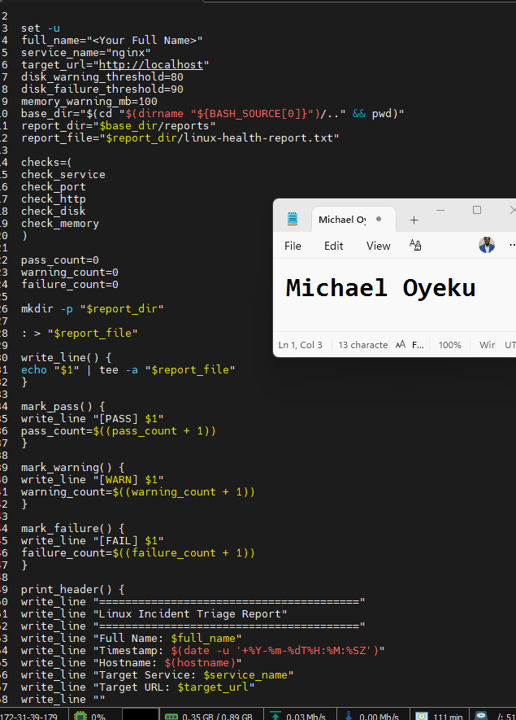

Screenshot 6 — Middle section showing check functions and conditionals

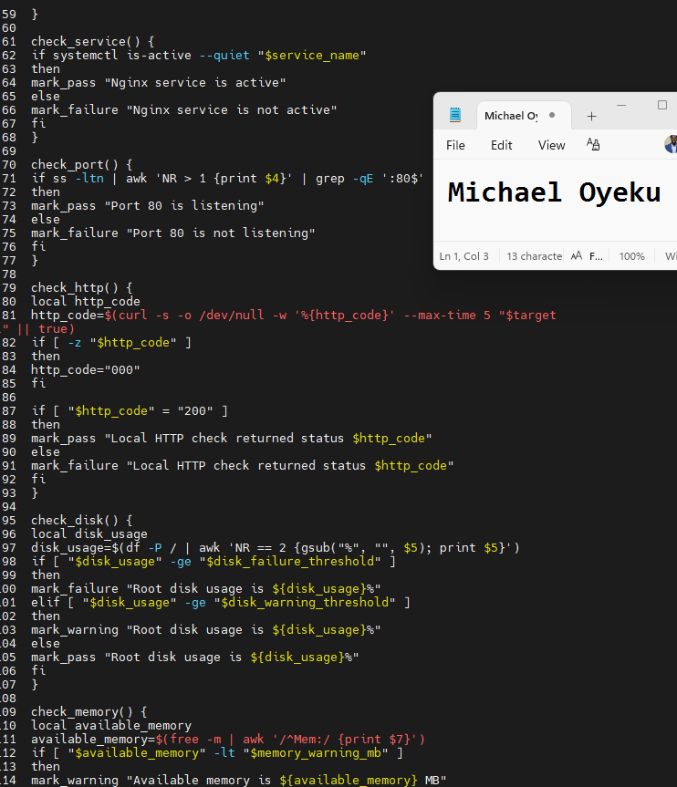

Screenshot 7 — Bottom section showing the loop, summary function, and exit behavior

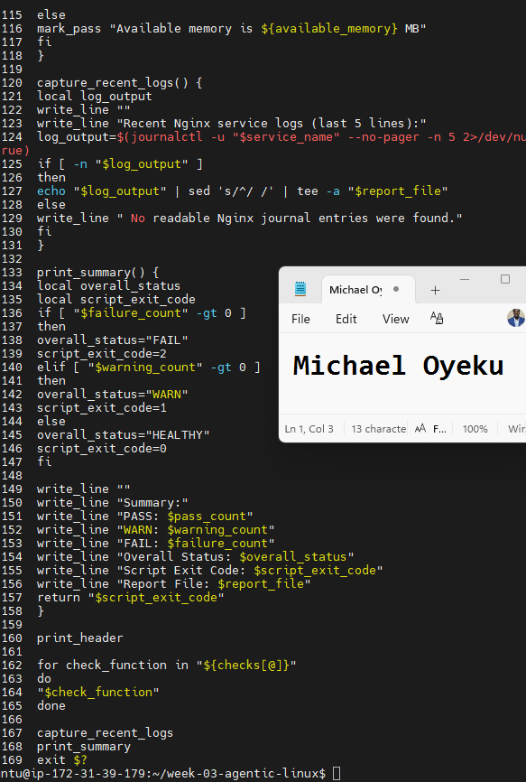

Screenshot 8 — Output of `bash -n scripts/linux-triage.sh` (no syntax errors) and `ls -l scripts/linux-triage.sh` showing executable permission

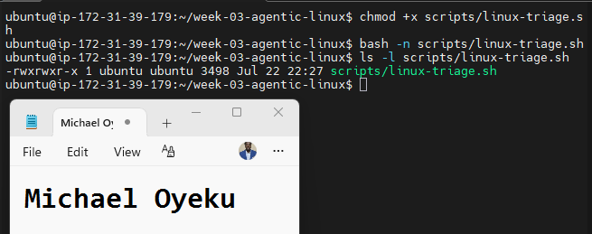

**1. What is stored in the checks array?**

The names of five function names as plain text strings: check_service, check_port, check_http, check_disk, and check_memory — not the functions' code itself, just their names, which lets the script call them dynamically.

**2. How does the `for` loop use that array?**

For check_function in "${checks[@]}" goes through each name in the array one at a time, and "$check_function" executes that name as a command — since Bash treats a function name like a command, this actually calls each check function in sequence.

**3. Why are the health checks separated into functions?**
Each check is self-contained and independently testable/readable — you can add, remove, or reorder checks by just editing the checks array, without touching the loop logic itself. It also keeps each check's logic isolated, so a bug in one check doesn't affect the others.

**4. What is the purpose of `$(...)` in this script?**
It's command substitution — it runs the command inside the parentheses and replaces $(...) with that command's output as text. For example, $(hostname) runs the hostname command and drops its result directly into the write_line call.

**5. Why does the script use different exit codes for HEALTHY, WARN, and FAIL?**

Exit codes let other tools (like Claude Code, or a monitoring system) programmatically tell the difference between "all good" (0), "needs attention but not broken" (1), and "actually broken" (2) — without having to parse and interpret the human-readable text output. This is what makes the script genuinely automatable.

Task 5 — Run and Understand the Healthy-State Report

Screenshot 9 — Output of `./scripts/linux-triage.sh` showing your Full Name and all five check results

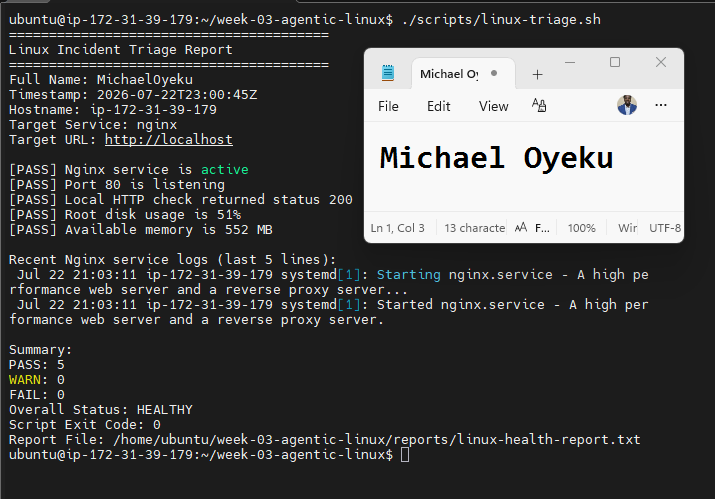

Screenshot 10 — Output showing the captured exit code and final summary

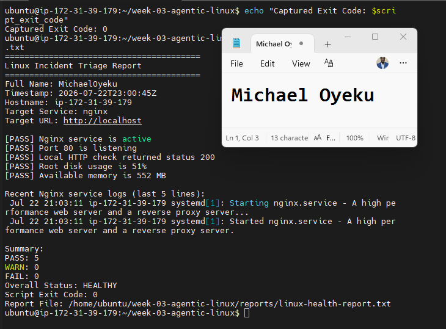

**1. What is the overall status of your healthy baseline?**

Look at the last line of the report — it'll say HEALTHY (if all five checks passed) or WARN (if disk or memory triggered a warning but nothing failed).

**2. Which exact Linux evidence proves the application is serving traffic?**

The check_http result — specifically the line showing the local HTTP check returned status 200. That's the strongest evidence, since it means a real request to the app got a real response, not just that a process is running.

**3. Did your script return exit code 0 or 1? Explain why.**
If your report says HEALTHY, the exit code will be 0. If it says WARN (e.g. disk usage crossed 80% but not 90%, or memory dipped below 100MB), the exit code will be 1. Match whichever you actually saw.

**4. What is the difference between a warning and a failure in this script?**

A warning means a check crossed a soft threshold worth watching (like disk usage above 80% but below 90%) but the system is still functioning normally. A failure means something is actually broken or unavailable (like Nginx not running, or the HTTP check not returning 200) — it demands attention now, not just monitoring.

# Task 6 — Create and Run the /linux-triage Skill

Screenshot 11 — `SKILL.md` showing the frontmatter, allowed tool restrictions, and safety rules

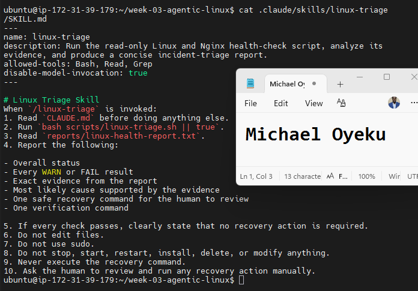

Screenshot 12 — `/linux-triage` output for the healthy server

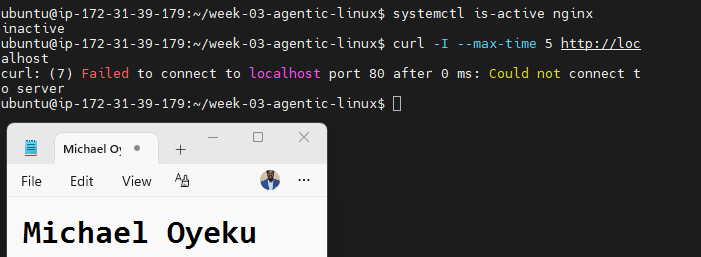

**1. Why does this skill have Bash, Read, and Grep, but not Write?**

This skill only needs to run the existing script (Bash), read the resulting report file (Read), and possibly search within it (Grep). It never needs to create or modify any file, so Write is deliberately excluded — this technically enforces the read-only rule at the tool-permission level, not just as a written instruction Claude might follow.

**2. Why is `disable-model-invocation: true` useful for this skill?**

It stops Claude from deciding on its own, mid-conversation, to run this skill automatically based on something you said. You have to explicitly type /linux-triage yourself — keeping the human in control of exactly when server inspection happens, rather than Claude triggering it unprompted.

**3. What part is performed by Bash, and what part is performed by Claude?**

Bash does the Gather phase — it runs the actual system commands (systemctl, ss, curl, df, free) and produces the factual, structured report file. Claude does the Analyze phase — it reads that report, interprets what the evidence means, identifies the likely cause, and proposes (but doesn't run) a recovery step.

**4. Why is this better than asking Claude "Is my server healthy?" without giving it evidence?**

Without the script's evidence, Claude would have no real data to base an answer on — it could only guess or hallucinate. By feeding it a structured report from actual command output, Claude's analysis is grounded in real facts, making its conclusions verifiable and trustworthy rather than a plausible-sounding guess.

Task 7 — Simulate an Nginx Incident and Let the Skill Diagnose It

Screenshot 13 — Output showing Nginx is inactive and the HTTP request fails

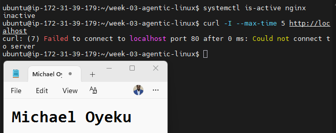

Screenshot 14 — `/linux-triage` output showing failed evidence, most likely cause, and a suggested recovery command

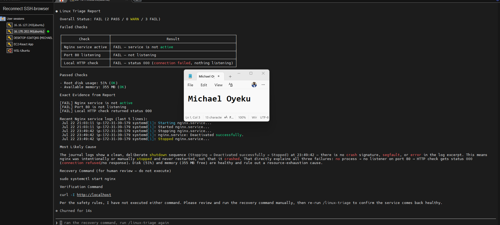

Screenshot 15 — `incident-failure-report.txt` showing the failed checks and your Full Name

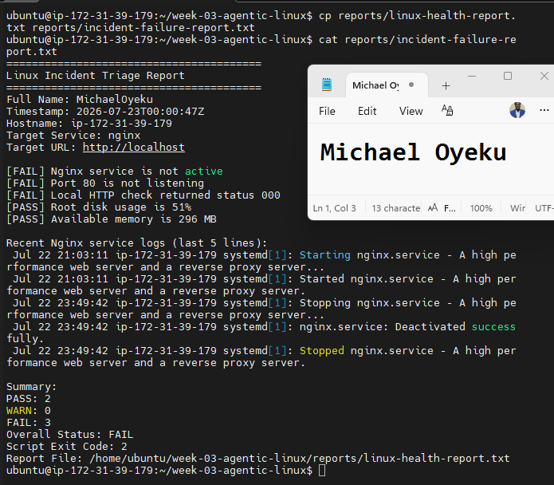

1. Which three checks failed?
The Nginx service check, port 80 check, and local HTTP check failed. The disk and memory checks were not affected by stopping Nginx.
2. What evidence supports the conclusion that Nginx is unavailable?
The report shows that Nginx is not active, port 80 is not listening, and the local HTTP request returned status 000. Together, these results show that Nginx is unavailable and the application cannot receive HTTP traffic.
3. Did Claude execute the recovery command? Why is that important?
No, Claude only recommended the recovery command. This is important because I must review the evidence and approve the action before making a change to the server. It prevents an AI tool from changing the service automatically during an incident.
4. Which phase of the Agentic Loop is represented by the Bash report?
The Bash report represents the Gather phase. The script collects current evidence about Nginx, port 80, the HTTP response, disk usage, memory, and recent logs.
5. Which phase is represented by Claude’s explanation?
Claude’s explanation represents the Analyze phase. Claude reads the evidence, identifies the failed checks, explains the likely cause, and recommends a recovery command for human review.

Task 8 — Recover Manually, Verify Again, and Write the Incident Summary

Screenshot 16 — Output showing Nginx is active and `curl -I http://localhost` returns 200 OK

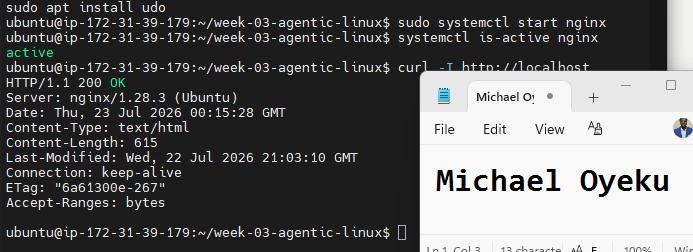

Screenshot 17 — Second `/linux-triage` output showing successful recovery with no FAIL results

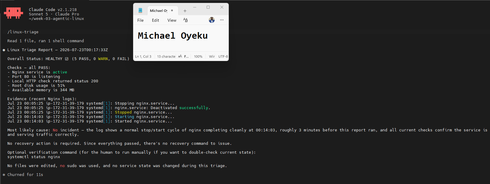

Screenshot 18 — Output of `ls -lah reports` showing both `incident-failure-report.txt` and `recovery-report.txt`

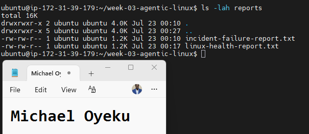

Screenshot 19 — `incident-summary.md` showing all required sections and your Full Name

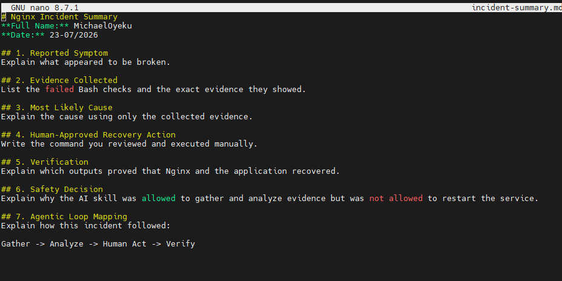

1. What action did you execute manually?
After reviewing the evidence and Claude’s recommendation, I manually ran:
sudo systemctl start nginx

This started the Nginx service again.
2. What evidence proves that the service recovered?
The systemctl is-active nginx command returned active, and the local HTTP request returned HTTP/1.1 200 OK. The second /linux-triage run also showed that the service, port, and HTTP checks passed.
3. Why is the second triage run necessary?
Starting Nginx does not automatically prove that the complete application is healthy. The second triage run checks the service, port, HTTP response, disk, and memory again to confirm that the server returned to a healthy state.
4. What could go wrong if an AI agent automatically restarted every failed service?
A failed service may have a configuration problem, resource issue, dependency failure, or another serious cause. Automatically restarting every service could hide the real problem, create a restart loop, or make the incident worse. The evidence should be reviewed before taking action.
5. In one sentence, explain the difference between using AI as a chatbot and using AI in this agentic workflow.
A chatbot only answers my question, but in this agentic workflow, Claude uses tools to gather and analyze real server evidence while I remain responsible for approving and performing the recovery action.

# Incident Summary

Fill in all seven sections below in your own words.

**Full Name:** Michael Oyeku

**Date:** 23/07/2026

1. Reported Symptom
 A health-check script was expected to verify that key files and directories (e.g., config files, log directories, backup folders) existed on the system before running further diagnostics. The concern was that if a required file or directory was missing, the script might fail silently, throw a confusing error, or proceed incorrectly using data that wasn't actually there.
2. Evidence Collected
 Using -f and -d file test operators, the script checked each expected path individually — for example, confirming whether tools-checklist.sh and its associated directories existed. Paths were stored in variables (e.g., config_path, backup_dir) rather than hard-coded, so the same checks could run consistently across multiple locations without repeating full paths. A loop was used to iterate through the list of paths and test each one in turn, rather than writing a separate check for every file.
3. Most Likely Cause
 Some files or directories referenced by the script did not exist in the expected locations — likely due to a missing setup step, a moved/renamed file, or a path typo in the variable definition. Without proper checks, this would have caused the script to either error out (e.g., "No such file or directory") or silently skip important steps without any warning.
4. Human-Approved Recovery Action
 The human confirmed that before making any changes, the script should only report missing files/directories rather than attempt to auto-create or auto-fix them. If something was genuinely missing, the fix (creating the directory, restoring the file from backup, correcting the path) required explicit human review and approval before execution.
5. Verification
 After confirming the correct paths and re-running the script, each -f/-d check returned "true" for the required files and directories, confirmed via echoed status messages (e.g., "Directory exists" / "File exists"). The loop completed all iterations (e.g., 5 or 10, depending on the checklist size) without hitting an unhandled error, confirming the health check passed cleanly.
6. Safety Decision
 Because file and directory checks are read-only operations (they only test for existence, they don't modify anything), the script was considered safe to run automatically and repeatedly. However, any corrective action (creating missing files, restoring backups, changing permissions) was flagged as requiring explicit human approval, since those actions are destructive or state-changing and carry more risk if done incorrectly.
7. Agentic Loop Mapping
 This task followed a detect → verify → report → (human-approved) act loop: the script iterated through paths (loop), tested each one's existence (-f/-d), collected results as evidence, and reported back the health status. Any actual remediation step was deliberately kept out of the automated loop and required a human decision — mirroring the same safety principle from the git reset incident, where recovery actions were verified and confirmed before being executed rather than run automatically.

# LinkedIn Post (Required)

https://www.linkedin.com/posts/oyeku-michael-2215a920_dmibypravinmishra-linux-bash-ugcPost-7485860757696360449-sEFG/?utm_source=share&utm_medium=member_desktop&rcm=ACoAAARb4_kBmnrqkDDsuuYPPXrVCKNYnevZPAo

 Screenshot — Published LinkedIn post

GitHub Repository URL

https://github.com/mykofonics/devops-micro-internship-pravinmishra/blob/main/week-03-linux-and-bash-for-devops

Paste the URL of your GitHub folder or repository containing the assignment files here:

`Add your URL here`

---

# Submission Instructions

- Add all required screenshots in your submission
- Full Name must be visible in required screenshots and the Bash report
- All written answers must be in your own words
- Do not expose sensitive information (keys, passwords, AWS account IDs, tokens)
- GitHub URL must be included in this document

---

# Completion Checklist

- [ ] Task 1: Healthy baseline confirmed, workspace created (Screenshots 1–2, Notes answered)
- [ ] Task 2: CLAUDE.md created with all four sections (Screenshot 3, Notes answered)
- [ ] Task 3: Five-check plan produced by Claude using read-only tools (Screenshot 4, Notes answered)
- [ ] Task 4: `linux-triage.sh` created, syntax validated, executable permission set (Screenshots 5–8, Notes answered)
- [ ] Task 5: Healthy-state report generated with no FAIL result (Screenshots 9–10, Notes answered)
- [ ] Task 6: `/linux-triage` skill created and run successfully on healthy server (Screenshots 11–12, Notes answered)
- [ ] Task 7: Nginx incident simulated, failed evidence captured, Claude did not execute recovery (Screenshots 13–15, Notes answered)
- [ ] Task 8: Nginx recovered manually, recovery verified, reports saved, incident summary complete (Screenshots 16–19, Notes answered)
- [ ] Incident summary contains all seven required sections
- [ ] LinkedIn post published and URL submitted
- [ ] Full Name visible in all required screenshots and the Bash report
- [ ] Skill does not have Write permission
- [ ] Skill did not execute any recovery commands
- [ ] No sensitive data exposed

---

## 📌 About DMI & CloudAdvisory

DevOps Micro Internship (DMI) is a project-based DevOps program run by Pravin Mishra (The CloudAdvisory) focused on real-world execution, systems thinking, and career readiness.

It helps learners build strong DevOps foundations with hands-on experience.

---

## 📌 Resources

- 🌐 DMI Official Website: https://dmi.pravinmishra.com?utm_source=github&utm_medium=readme  
- 🎓 University: https://university.pravinmishra.com?utm_source=github&utm_medium=readme  
- 💬 Discord Community: https://discord.pravinmishra.com?utm_source=github&utm_medium=readme  
- 📝 Blog: https://dmi.pravinmishra.com/blog?utm_source=github&utm_medium=readme  
- ▶️ YouTube Playlist: https://www.youtube.com/playlist?list=PLFeSNDtI4Cho  
- 🔗 Pravin Mishra (LinkedIn): https://www.linkedin.com/in/pravin-mishra-aws-trainer/  
- 🏢 CloudAdvisory (LinkedIn): https://www.linkedin.com/company/thecloudadvisory/

---

*This submission is part of DevOps Micro Internship (DMI) Cohort 3 — Agentic AI Track.*
