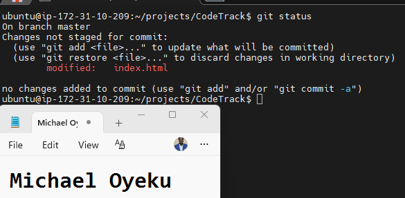
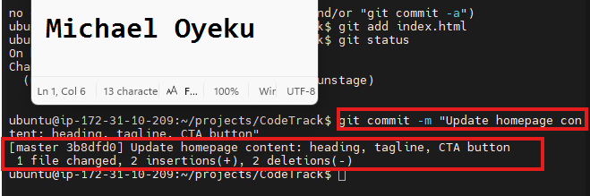
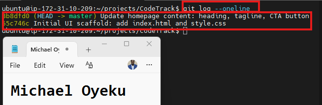
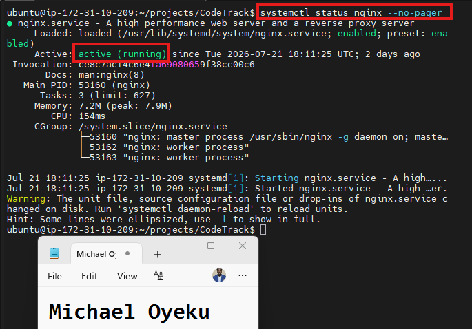
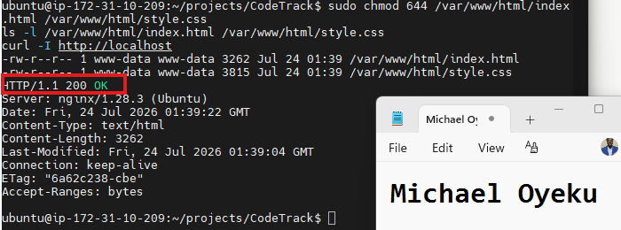
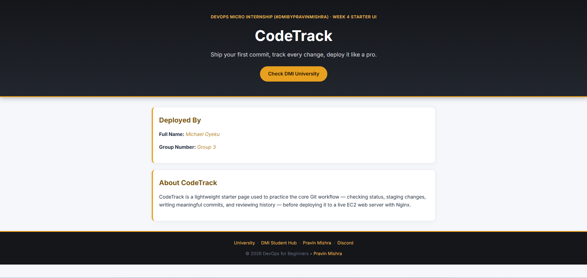

Assignment 2 — CodeTrack: Tracking, Staging, Committing + Deploy to EC2

Task 1 — Verify Git Setup and Enter the Repository

Screenshot 1 — Output of `pwd` showing you're inside `CodeTrack`

Task 2 — Create index.html and style.css

 Screenshot 3 — Output of `ls` showing `index.html` and `style.css`

Task 3 — Add Starter Content

Screenshot 4 — Your editor showing the contents of `index.html` and `style.css`
 

Task 4 — Track and Stage Files Correctly

Screenshot 5 — Output of `git status` showing both files as untracked
 

Screenshot 6 — Output of `git status` showing both files staged under "Changes to be committed"

Task 5 — Create the First Commit (Clean Initial Commit)

Screenshot 7 — Output of `git commit`

Screenshot 8 — Output of `git log --oneline` showing the first commit

Task 6 — Modify index.html and Create a Second Commit

Screenshot 9 — Browser showing the updated page with your Student Name and Group Name visible

Screenshot 10 — Output of `git status` showing `index.html` as modified

Screenshot 11 — Output of `git commit`

Screenshot 12 — Output of `git log --oneline` showing two commits

Task 7 — Deploy to EC2 with Nginx (Static Website)

Screenshot 13 — Output of `systemctl status nginx --no-pager` showing Nginx `active (running)`

Screenshot 14 — Output of `curl -I http://localhost` showing `HTTP/1.1 200 OK`

Screenshot 15 — Browser showing the CodeTrack site loaded at `http://16.16.127.243/`, with your Full Name and Group Name visible

# LinkedIn Post (Required)

:

https://www.linkedin.com/posts/oyeku-michael-2215a920_dmibypravinmishra-devops-agenticai-share-7486237812241981440-4UN8/?utm_source=share&utm_medium=member_desktop&rcm=ACoAAARb4_kBmnrqkDDsuuYPPXrVCKNYnevZPAo

Screenshot — LinkedIn post showing the deployed CodeTrack application

