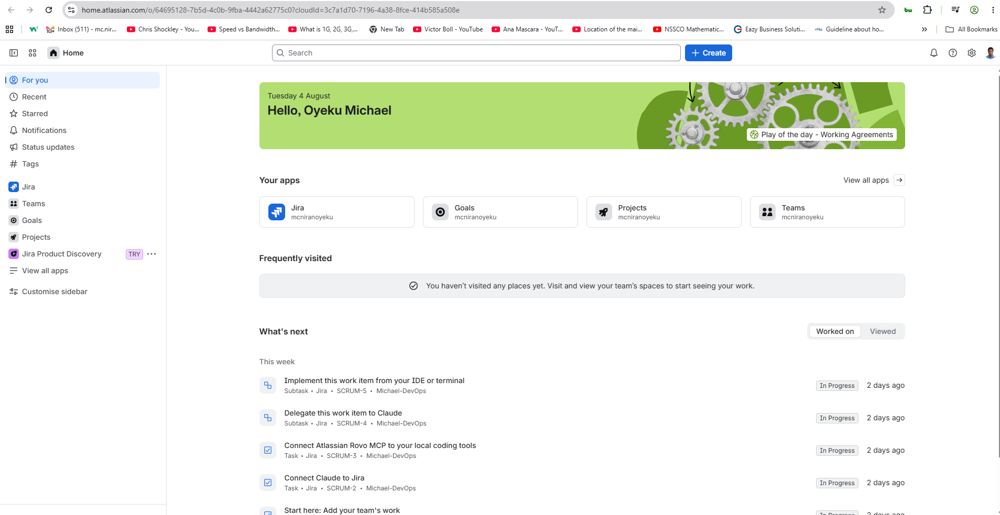
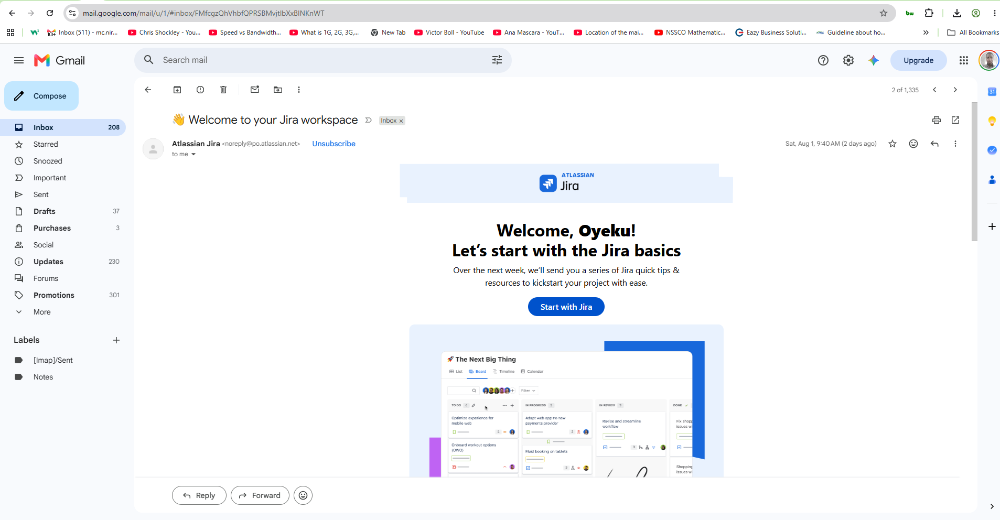
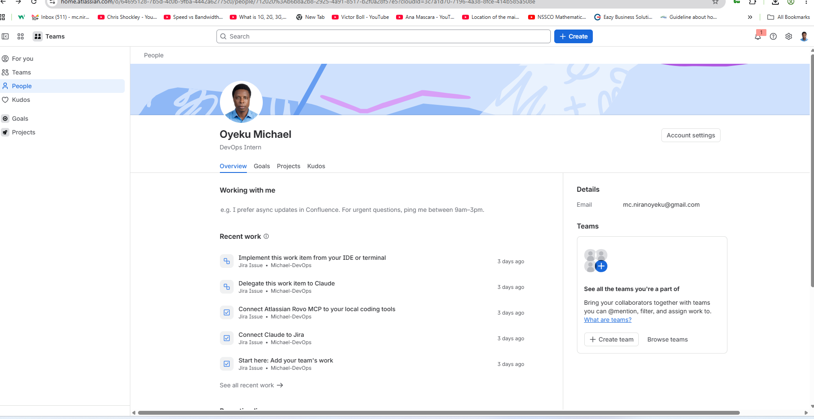
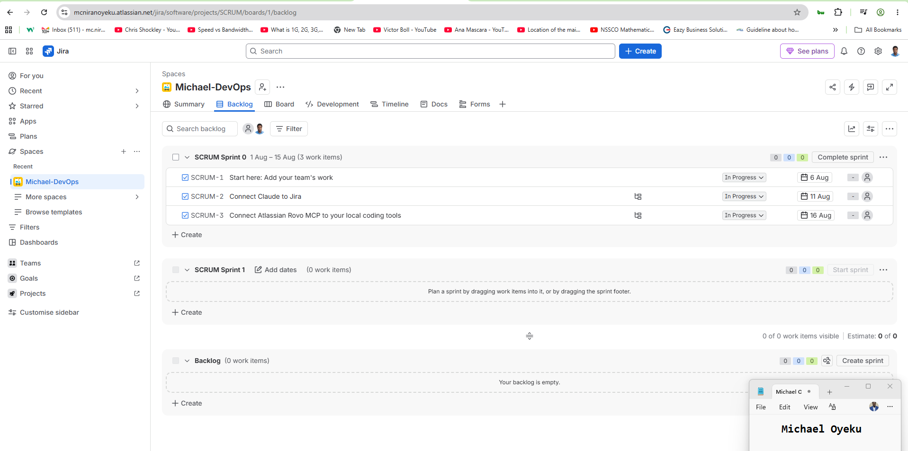

# Assignment 1 — Create Your Jira Account & Setup Profile

Part of the DevOps Micro Internship (DMI) Cohort 3 with Agentic AI

---

## Purpose

In this assignment, you will create or access a Jira Software Cloud account, verify your Atlassian identity when required, set up a professional profile, and explore the Jira dashboard and project areas. This prepares you for real-world Agile and DevOps collaboration, where Jira is commonly used to plan work, assign tickets, and track progress. You will explore the workspace only — you will not create any issues in this assignment.

---

# Task 1 — Sign Up for Jira Software Cloud

## Goal

Create or access your Jira Cloud account and reach the Jira Software workspace successfully.

### Evidence

#### Screenshot 1 — Jira welcome page, dashboard, or main workspace after successful login, with your name or avatar visible

# Task 2 — Verify Your Atlassian Account

## Goal

Confirm your email address if Atlassian requests verification.

### Evidence

#### Screenshot 2 (if applicable) — Confirmation screen after email verification, or the inbox showing the Atlassian verification email subject

  

## I have registered for this account before. The confiremation page is not available for the screenshot capture.

### Notes

If you signed up with Google and no separate email verification was required, include the following statement instead of Screenshot 2:

> I signed up using Google, and Atlassian did not require separate email verification.

Add any additional notes here.

---

# Task 3 — Set Up Your Professional Jira Profile

## Goal

Update your Jira profile with your full name, a job title or role (e.g. "Aspiring DevOps Engineer"), and a short professional bio.

### Evidence

#### Screenshot 3 — Updated profile page showing your full name, role/title, and bio

# Task 4 — Explore the Jira Dashboard and Projects

## Goal

Locate the project list and open a project's Board or Backlog, and view Project settings, without creating, editing, or deleting any issues.

### Evidence

#### Screenshot 4 — "View all projects" page showing at least one project

#### Screenshot 5 — Opened project showing either the Board or Backlog screen

